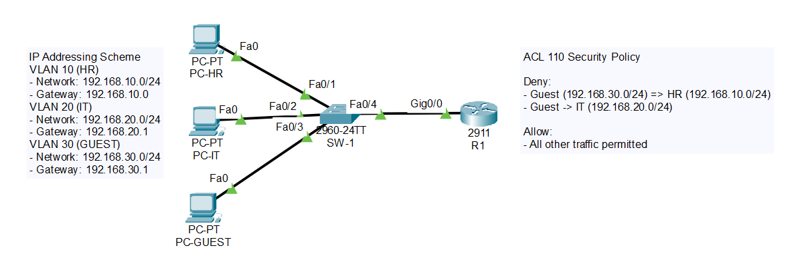
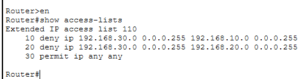
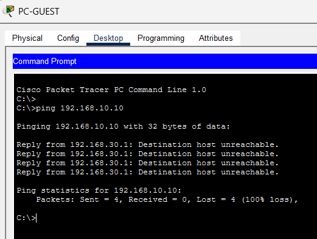
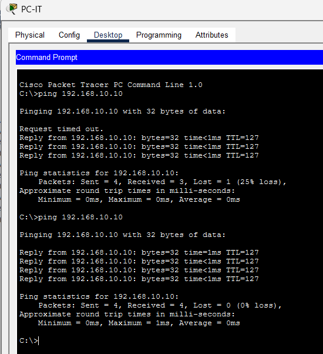

# vlan-segmentation-security-lab

Network Segmentation & ACL Firewall Lab

**Overview**

Designed and implemented a segmented network using VLANs and router-on-a-stick architecture with ACL-based traffic filtering to simulate enterprise network security controls.

**Tools Used**

Cisco Packet Tracer

**Network Design**

VLAN 10: HR

VLAN 20: IT

VLAN 30: Guest

Router-on-a-stick inter-VLAN routing

**Security Implementation**
Extended ACL configured to restrict Guest VLAN access to internal networks

Applied ACL on router subinterface (g0/0.30)

Verified traffic filtering between VLANs

**Validation**

Ping tests performed between VLANs

Guest VLAN successfully blocked from accessing HR and IT networks

Internal VLAN communication allowed based on policy

### 🖥️ Network Topology

### 🔐 ACL Configuration

### ❌ Blocked Traffic (Guest → HR)

### ✅ Allowed Traffic (IT → HR)

This lab demonstrates enterprise-style network segmentation and basic firewall enforcement using ACLs. 
It simulates how organizations control traffic flow between departments to reduce attack surface and enforce security policies.
